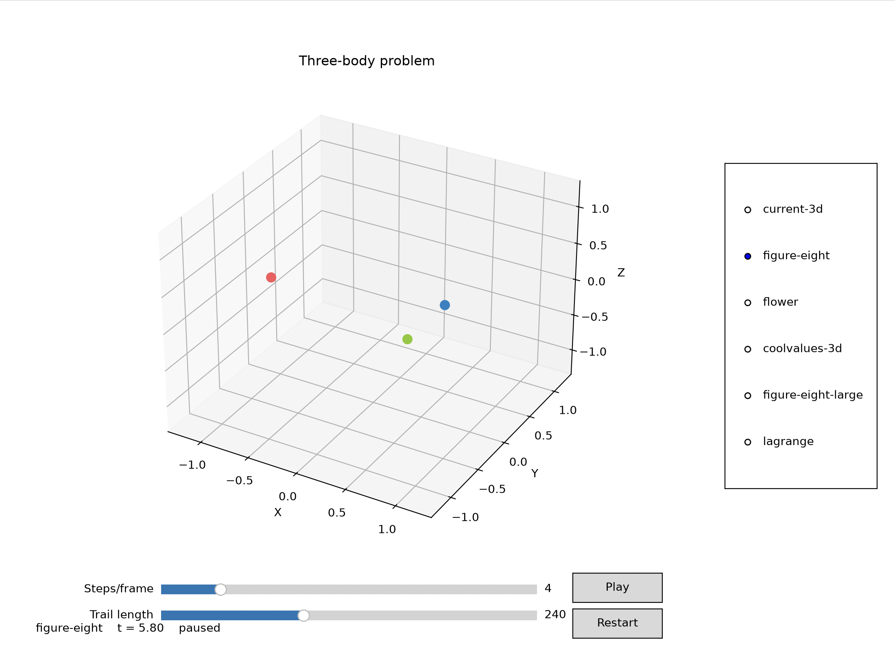

# Three-Body Simulation

A Python simulation of the interaction between three gravitating bodies.
Trajectories are displayed in an interactive Matplotlib animation.

Contains multiple pre-sets of periodic solutions to test out!



## Requirements

You need Python 3 and the following packages:

```bash
pip install numpy matplotlib
```
